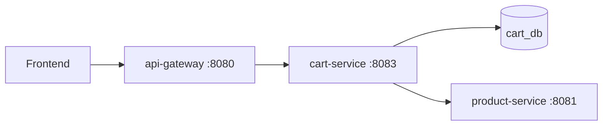

# Cart service flow

Per-user shopping cart: add products, change quantities, remove items. Cart state lives in **cart-service**; product validation goes to **product-service** over HTTP.

## Ports and paths

| Where | URL |
|-------|-----|
| Gateway (frontend) | `http://localhost:8080/api/carts/...` |
| cart-service (internal) | `http://localhost:8083/carts/...` |

The gateway rewrites `/api/carts` → `/carts` and forwards to `CART_SERVICE_URL`.

## Endpoints

| Method | Gateway | cart-service | Purpose |
|--------|---------|--------------|---------|
| GET | `/api/carts/:userId` | `/carts/:userId` | List cart items |
| POST | `/api/carts/:userId/items` | `/carts/:userId/items` | Add item (body: `productId`, `quantity`) |
| PATCH | `/api/carts/:userId/items/:productId` | `/carts/:userId/items/:productId` | Set quantity (body: `quantity`) |
| DELETE | `/api/carts/:userId/items/:productId` | `/carts/:userId/items/:productId` | Remove one item |
| GET | — | `/health` | Health check |

**Note:** Use `/api/carts/1`, not `/api/carts:1`. The user id is a path segment.

## Architecture

```text
Frontend
   │
   ▼
api-gateway :8080          (CART_SERVICE_URL)
   │
   ▼
cart-service :8083
   ├──► cart_db (Postgres)           read/write cart_items
   └──► product-service :8081        GET /products/:id (validate product exists)
```



## Request flow (add item example)

```text
POST /api/carts/1/items  {"productId":1,"quantity":2}
```

1. **api-gateway** — receives `/api/carts/1/items`, proxies to `http://cart-service:8083/carts/1/items`.
2. **handler** (`internal/handler`) — parses `userId`, binds JSON, maps errors to HTTP status.
3. **service** (`internal/service`) — checks `quantity > 0`; calls product-service to confirm product exists.
4. **client** (`internal/client`) — `GET {PRODUCT_SERVICE_URL}/products/1`.
5. **repository** (`internal/repository`) — if item already in cart, **adds** quantity; otherwise inserts a new row.
6. **database** — GORM persists to `cart_items` in `cart_db`.

Response: `201` with the cart line item JSON.

## Layer map

```text
cmd/server/main.go       → wire dependencies, register Gin routes
internal/handler         → HTTP / JSON (parse :userId, :productId)
internal/service         → business rules (quantity, merge on add, product check)
internal/repository      → GORM CRUD on cart_items
internal/client          → HTTP call to product-service
internal/model           → CartItem struct + NewCartItem helper
internal/database        → Postgres connect + AutoMigrate cart_items table
```

Startup order in `main.go`:

```text
database.Connect() → NewCartRepository() → NewProductClient() → NewCartService() → NewCartHandler() → routes
```

## Data model

Table: `cart_items` in database `cart_db`

| Column | Type | Notes |
|--------|------|-------|
| `id` | serial | Primary key |
| `user_id` | bigint | One cart per user (rows keyed by user) |
| `product_id` | bigint | References product catalog |
| `quantity` | int | Must be &gt; 0 |

Unique index on `(user_id, product_id)` — at most one row per user + product.

## HTTP status codes

| Status | When |
|--------|------|
| `200` | GET cart (empty cart returns `[]`) |
| `201` | Item added |
| `204` | Item removed |
| `400` | Invalid user/product id or quantity |
| `404` | Product not found (product-service) or cart line not found |
| `500` | Database or product-service unreachable |

## Environment variables

| Variable | Default (local) | Docker Compose |
|----------|-----------------|----------------|
| `PORT` | `8083` | `8083` |
| `DB_HOST` / `DB_NAME` | — / `cart_db` | `postgres` / `cart_db` |
| `PRODUCT_SERVICE_URL` | `http://localhost:8081` | `http://product-service:8081` |

Gateway also needs `CART_SERVICE_URL=http://cart-service:8083` inside Docker (see `deploy/docker-compose.yml`).

## Docker notes

- **Database:** `cart_db` is created by `deploy/init/01-create-databases.sql` on a fresh Postgres volume. For existing volumes, `deploy/scripts/ensure-databases.sh` runs via the `db-bootstrap` service.
- **Depends on:** Postgres (healthy), `db-bootstrap`, product-service.

## Try it

```bash
cd deploy && docker compose up --build

# Health (gateway aggregates cart status)
curl http://localhost:8080/health

# Empty cart
curl http://localhost:8080/api/carts/1

# Add item (product 1 must exist in product_db seed data)
curl -X POST http://localhost:8080/api/carts/1/items \
  -H "Content-Type: application/json" \
  -d '{"productId":1,"quantity":2}'

# View cart
curl http://localhost:8080/api/carts/1

# Update quantity
curl -X PATCH http://localhost:8080/api/carts/1/items/1 \
  -H "Content-Type: application/json" \
  -d '{"quantity":1}'

# Remove item
curl -X DELETE http://localhost:8080/api/carts/1/items/1
```

## Local development (without Docker)

1. Ensure Postgres has database `cart_db` (see `deploy/init/` or run `CREATE DATABASE cart_db;`).
2. Start product-service, then cart-service:

```bash
cd product-service && PORT=8081 DB_NAME=product_db go run ./cmd/server
cd cart-service && PORT=8083 DB_NAME=cart_db PRODUCT_SERVICE_URL=http://localhost:8081 go run ./cmd/server
cd api-gateway && PORT=8080 CART_SERVICE_URL=http://localhost:8083 go run ./cmd/server
```

## Relation to checkout

- **user-service** provides `userId` after login (JWT flow in [USER_SERVICE_FLOW.md](USER_SERVICE_FLOW.md)).
- **cart-service** stores what the user intends to buy.
- **order-service** (planned) will read the cart, create an order, and clear the cart.

Auth on cart routes is not enforced yet; `userId` is passed in the URL. In production, the gateway or cart-service should verify the JWT and ensure the caller can only access their own cart.
