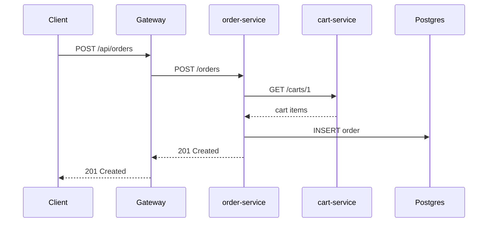
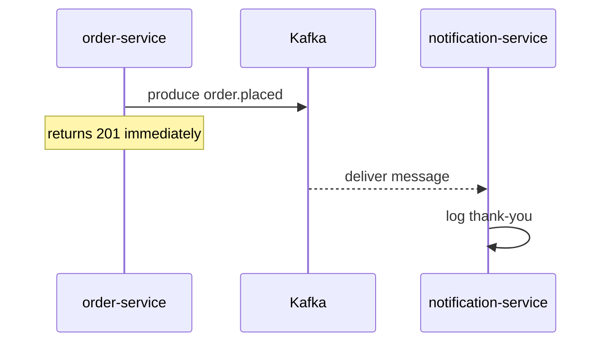
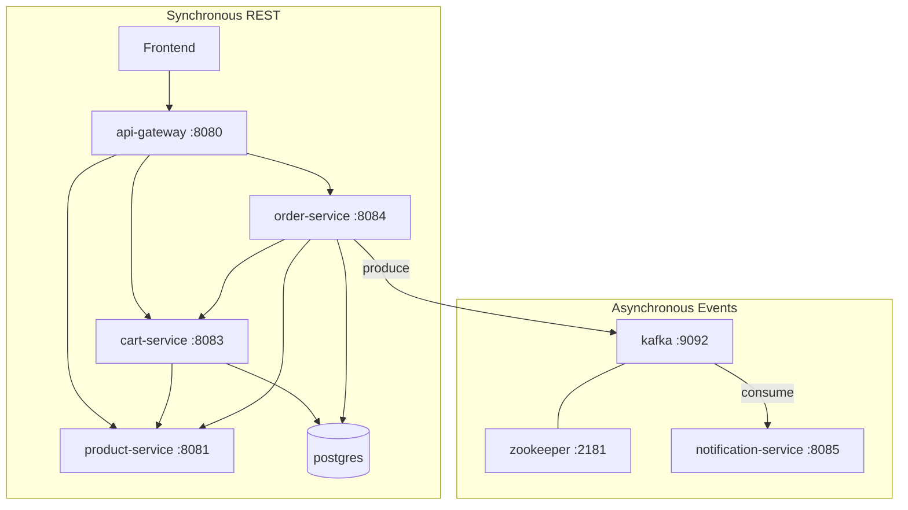

# Kafka Implementation — Phase 1

This document explains **why** Kafka was introduced, **how** it fits into the ecommerce backend, and **how to run and test** the first event-driven flow: `order.placed`.

---

## Table of Contents

1. [Why Kafka?](#1-why-kafka)
2. [Sync vs async communication](#2-sync-vs-async-communication)
3. [Kafka concepts glossary](#3-kafka-concepts-glossary)
4. [Architecture](#4-architecture)
5. [Docker setup](#5-docker-setup)
6. [Topic: order.placed](#6-topic-orderplaced)
7. [Producer (order-service)](#7-producer-order-service)
8. [Consumer (notification-service)](#8-consumer-notification-service)
9. [End-to-end event flow](#9-end-to-end-event-flow)
10. [Testing steps](#10-testing-steps)
11. [Expected output and logs](#11-expected-output-and-logs)
12. [Troubleshooting](#12-troubleshooting)
13. [Future phases](#13-future-phases)

---

## 1. Why Kafka?

Before Kafka, every step in checkout was **synchronous HTTP**:

```text
Client → gateway → order-service → cart-service → product-service → Postgres
```

That works for creating an order, but **side effects** (email, SMS, analytics, inventory) should not block the user. If sending a confirmation email is slow or fails, checkout should still succeed.

**Kafka introduces asynchronous events:**

- **order-service** publishes `order.placed` after the order is saved.
- **notification-service** consumes the event and logs a thank-you message (Phase 1 stand-in for email/SMS).

Benefits:

| Benefit | Explanation |
|---------|-------------|
| **Decoupling** | Order service does not know about notifications |
| **Scalability** | Scale notification workers independently |
| **Resilience** | Consumer can restart and resume from last offset |
| **Extensibility** | Add inventory or analytics consumers without changing order-service |

---

## 2. Sync vs async communication

### Synchronous REST (request/response)



The client **waits** for every hop. The response means "order is saved."

### Asynchronous events (fire-and-forget)



The client does **not** wait for notification. The event means "something happened — react when you can."

---

## 3. Kafka concepts glossary

| Term | What it is | In this project |
|------|------------|-----------------|
| **Broker** | Kafka server that stores messages | `kafka` container on port `9092` (host) / `29092` (Docker network) |
| **Zookeeper** | Coordinates Kafka cluster metadata (Confluent classic mode) | `zookeeper` container on port `2181` |
| **Topic** | Named channel for messages | `order.placed` |
| **Partition** | Ordered sub-stream inside a topic | Auto-created; keyed by `userId` |
| **Offset** | Position of a message in a partition | Tracked per consumer group |
| **Producer** | Writes messages to a topic | `order-service` after checkout |
| **Consumer** | Reads messages from a topic | `notification-service` |
| **Consumer group** | Consumers sharing work; each message delivered once per group | `notification-service` |
| **Message key** | Optional bytes used to pick partition | `userId` as string |

---

## 4. Architecture



---

## 5. Docker setup

### Start everything

```bash
cd deploy
docker compose up --build
```

### Services added for Phase 1

| Service | Image | Ports | Role |
|---------|-------|-------|------|
| `zookeeper` | `confluentinc/cp-zookeeper:7.6.1` | 2181 (internal) | Cluster coordination |
| `kafka` | `confluentinc/cp-kafka:7.6.1` | 9092 (host), 29092 (internal) | Message broker |
| `notification-service` | built from `../notification-service` | 8085 | Consumes `order.placed` |

### Listeners explained

| Listener | Address | Used by |
|----------|---------|---------|
| `PLAINTEXT` | `kafka:29092` | Services inside Docker Compose |
| `PLAINTEXT_HOST` | `localhost:9092` | Host machine (debugging with CLI tools) |

`KAFKA_AUTO_CREATE_TOPICS_ENABLE=true` creates `order.placed` on first publish.

### Environment variables

**order-service**

| Variable | Docker value |
|----------|--------------|
| `KAFKA_BROKERS` | `kafka:29092` |
| `KAFKA_TOPIC` | `order.placed` |

**notification-service**

| Variable | Docker value |
|----------|--------------|
| `KAFKA_BROKERS` | `kafka:29092` |
| `KAFKA_TOPIC` | `order.placed` |
| `KAFKA_GROUP_ID` | `notification-service` |

---

## 6. Topic: order.placed

### Schema

```json
{
  "eventType": "order.placed",
  "orderId": 1,
  "userId": 1,
  "totalAmount": 79999.00,
  "items": [
    {
      "productId": 1,
      "productName": "iPhone 16",
      "price": 79999.00,
      "quantity": 1
    }
  ],
  "placedAt": "2026-06-05T10:00:00Z"
}
```

### Message key

`userId` as a string (e.g. `"1"`). Messages for the same user go to the same partition, preserving order per user.

### Explicit topic creation (optional)

```bash
docker compose exec kafka kafka-topics \
  --bootstrap-server localhost:9092 \
  --create \
  --topic order.placed \
  --partitions 1 \
  --replication-factor 1
```

Not required when auto-create is enabled.

---

## 7. Producer (order-service)

### Files

| File | Purpose |
|------|---------|
| `internal/events/order_placed.go` | Event struct and builder |
| `internal/events/publisher.go` | Serializes JSON and calls Kafka |
| `internal/kafka/producer.go` | Wraps `kafka.Writer` from segmentio/kafka-go |
| `internal/service/order_service.go` | Publishes after DB save + cart clear |

### Flow

1. `PlaceOrder` saves order to `order_db`.
2. Cart items are cleared via cart-service HTTP calls.
3. `publisher.PublishOrderPlaced(ctx, order)` marshals JSON and writes to Kafka.
4. If publish fails, error is **logged** but HTTP still returns `201` (best-effort in Phase 1).

### Library

[`github.com/segmentio/kafka-go`](https://github.com/segmentio/kafka-go) — pure Go client compatible with Confluent brokers.

---

## 8. Consumer (notification-service)

### Files

| File | Purpose |
|------|---------|
| `internal/consumer/order_consumer.go` | `kafka.Reader` loop on `order.placed` |
| `internal/handler/health_handler.go` | `GET /health` |
| `cmd/server/main.go` | Starts consumer goroutine + health HTTP server |

### Flow

1. Consumer joins group `notification-service`.
2. `ReadMessage` blocks until a message arrives.
3. JSON is unmarshaled into `OrderPlacedEvent`.
4. Logs:
   - `[kafka] order.placed received — orderId=... userId=... total=...`
   - `Thank you for your order.`
   - `Order received successfully.`
5. Offset is committed automatically (`CommitInterval: 1s`).

On SIGTERM, context is cancelled and the reader closes gracefully.

---

## 9. End-to-end event flow

1. User adds product to cart: `POST /api/carts/1/items`.
2. User places order: `POST /api/orders` with `{"userId":1}`.
3. **api-gateway** proxies to **order-service**.
4. **order-service** reads cart, fetches prices, saves order, clears cart.
5. **order-service** produces `order.placed` to Kafka.
6. HTTP `201` returns to client (checkout complete).
7. **notification-service** consumes the event and logs thank-you messages.

---

## 10. Testing steps

```bash
cd deploy
docker compose up --build -d

# Wait for Kafka health (may take ~30s on first start)
docker compose ps kafka

# 1. Add item to cart
curl -X POST http://localhost:8080/api/carts/1/items \
  -H "Content-Type: application/json" \
  -d '{"productId":1,"quantity":1}'

# 2. Place order (triggers order.placed)
curl -X POST http://localhost:8080/api/orders \
  -H "Content-Type: application/json" \
  -d '{"userId":1}'

# 3. Verify notification-service logs
docker compose logs notification-service --tail 20

# Optional: watch messages from host
docker compose exec kafka kafka-console-consumer \
  --bootstrap-server localhost:9092 \
  --topic order.placed \
  --from-beginning
```

---

## 11. Expected output and logs

### HTTP response (order created)

```json
{
  "id": 1,
  "userId": 1,
  "totalAmount": 79999,
  "createdAt": "...",
  "items": [...]
}
```

### notification-service logs

```
[kafka] connecting broker=kafka:29092 topic=order.placed group=notification-service
notification-service listening on 0.0.0.0:8085
[kafka] order.placed received — orderId=1 userId=1 total=79999.00 partition=0 offset=0
Thank you for your order.
Order received successfully.
```

---

## 12. Troubleshooting

| Symptom | Likely cause | Fix |
|---------|--------------|-----|
| `502` on `/api/carts` or `/api/orders` | cart/order container down | `docker compose ps`; check logs |
| `database "cart_db" does not exist` | Old Postgres volume | `db-bootstrap` service creates missing DBs; run `docker compose up db-bootstrap` |
| Order `201` but no notification logs | Kafka not ready or consumer not started | Wait for `kafka` healthy; `docker compose logs notification-service` |
| `connection refused` to `localhost:8083` inside gateway | Missing `CART_SERVICE_URL` in Docker | Use `http://cart-service:8083` in compose |
| Producer errors in order-service logs | Wrong `KAFKA_BROKERS` | Use `kafka:29092` inside Docker, `localhost:9092` on host |
| Consumer reads old messages | `StartOffset: FirstOffset` | Expected on first run; use new consumer group to skip |
| Kafka `Exited (1)` / `NodeExistsException` | Stale broker registration in Zookeeper after unclean shutdown | See below |

### Kafka `NodeExistsException` fix

If `docker compose logs kafka` shows:

```text
KeeperException$NodeExistsException: KeeperErrorCode = NodeExists
```

Zookeeper still has old broker metadata from a previous Kafka container. Reset both:

```bash
cd deploy
docker compose stop kafka zookeeper
docker compose rm -f kafka zookeeper
docker compose up -d zookeeper
sleep 5
docker compose up -d kafka
docker compose up -d order-service notification-service
```

Or recreate the whole stack: `docker compose down && docker compose up -d --build`

---

## 13. Future phases

| Phase | Enhancement |
|-------|-------------|
| **Phase 2** | Idempotent consumers (dedupe by `orderId`) |
| **Phase 3** | Dead-letter topic (DLQ) for failed messages |
| **Phase 4** | `inventory.reserved` / `inventory.released` events |
| **Phase 5** | Real email/SMS adapters behind notification-service |
| **Phase 6** | Schema Registry (Avro/Protobuf) for contract evolution |
| **Phase 7** | Transactional outbox pattern (guaranteed publish with DB commit) |
| **Phase 8** | Migrate from Zookeeper to KRaft (Kafka 3.x native mode) |

---

## Related docs

- [CART_SERVICE_FLOW.md](CART_SERVICE_FLOW.md) — cart REST API
- [ORDER_SERVICE_FLOW.md](ORDER_SERVICE_FLOW.md) — checkout REST API
- [USER_SERVICE_FLOW.md](USER_SERVICE_FLOW.md) — authentication
