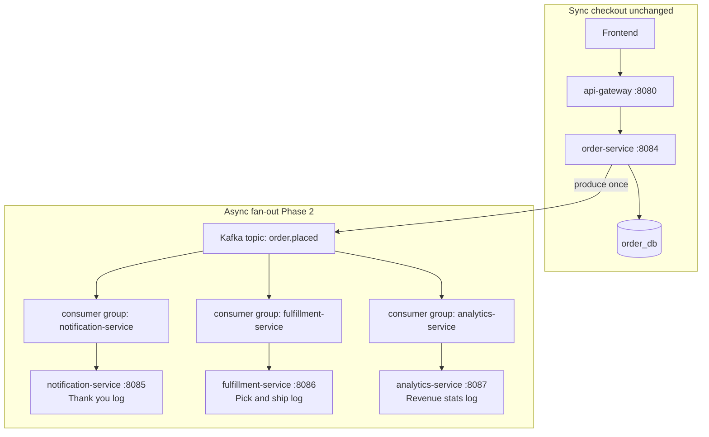
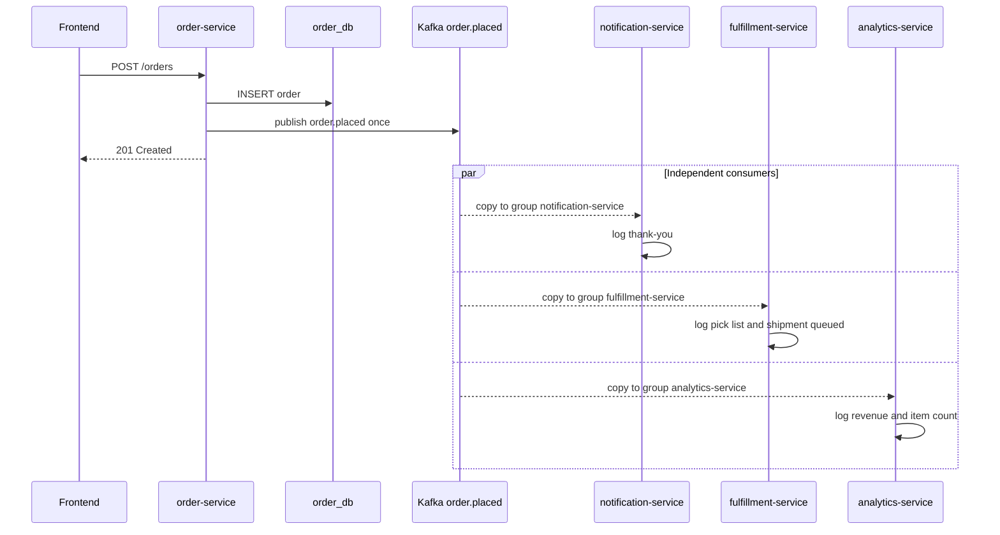

# Kafka Phase 2 — Multiple Consumers, One Event

Phase 1 proved **one producer → one consumer group → one reaction**. Phase 2 adds **fan-out**: order-service publishes **once** to `order.placed`, and Kafka delivers a **copy** of each message to every consumer group. Fulfillment and Analytics never call notification-service (or each other).

See [KAFKA_IMPLEMENTATION.md](KAFKA_IMPLEMENTATION.md) for Phase 1 setup, glossary, and troubleshooting.

---

## Table of Contents

1. [The aha moment](#1-the-aha-moment)
2. [Architecture](#2-architecture)
3. [Sequence: one checkout](#3-sequence-one-checkout)
4. [Consumer groups explained](#4-consumer-groups-explained)
5. [Event contract](#5-event-contract)
6. [Services in Phase 2](#6-services-in-phase-2)
7. [What stays unchanged](#7-what-stays-unchanged)
8. [Testing](#8-testing)
9. [Expected log output](#9-expected-log-output)
10. [Out of scope](#10-out-of-scope)

---

## 1. The aha moment

| | Phase 1 | Phase 2 |
|---|---------|---------|
| **Topology** | One producer → one consumer group | One producer → one topic → **three** consumer groups |
| **Publish count** | Once per order | Still **once** per order |
| **Coupling** | Order loosely knows notification exists | Order knows **nothing** about fulfillment or analytics |

**Rule:** Same topic + different `KAFKA_GROUP_ID` = each service gets every message independently.

---

## 2. Architecture



---

## 3. Sequence: one checkout



---

## 4. Consumer groups explained

Kafka tracks **offsets per consumer group**. When a new group subscribes to a topic, it receives its **own copy** of every message — independent of other groups.

| Concept | Phase 1 | Phase 2 |
|---------|---------|---------|
| **Topic** | `order.placed` | Same topic — no new topic needed |
| **Consumer group** | `notification-service` | Each service gets its **own** group ID |
| **Who knows whom?** | Order knows notification exists (loosely) | Order knows **nothing** about fulfillment or analytics |

### Consumer group table

| Service | Port | `KAFKA_GROUP_ID` | Topic |
|---------|------|------------------|-------|
| notification-service | 8085 | `notification-service` | `order.placed` |
| fulfillment-service | 8086 | `fulfillment-service` | `order.placed` |
| analytics-service | 8087 | `analytics-service` | `order.placed` |

All services use the same env vars for broker and topic:

```text
KAFKA_BROKERS=kafka:29092
KAFKA_TOPIC=order.placed
```

The **only** difference between consumers is `KAFKA_GROUP_ID`.

---

## 5. Event contract

Producer payload (published by order-service after DB save):

```json
{
  "eventType": "order.placed",
  "orderId": 1,
  "userId": 1,
  "totalAmount": 79999,
  "items": [
    {
      "productId": 1,
      "productName": "iPhone 16",
      "price": 79999,
      "quantity": 1
    }
  ],
  "placedAt": "2026-06-05T10:00:00Z"
}
```

Each consumer mirrors this struct locally. Fulfillment uses `items` for pick lists; Analytics uses `totalAmount` and `len(items)`.

---

## 6. Services in Phase 2

| Service | Port | Consumer group | Reacts by... |
|---------|------|----------------|--------------|
| notification-service | 8085 | `notification-service` | Logging thank-you to customer |
| fulfillment-service | 8086 | `fulfillment-service` | Logging pick list + shipment queued |
| analytics-service | 8087 | `analytics-service` | Logging revenue / item metrics |

All subscribe to topic `order.placed`. Order-service publishes **once**.

---

## 7. What stays unchanged

These files are **intentionally not modified** in Phase 2 — adding consumers proves event-driven architecture without touching the producer:

- `order-service/internal/service/order_service.go` — still publishes once after DB save
- `order-service/internal/events/order_placed.go` — canonical event schema
- `api-gateway/cmd/server/main.go` — no new REST routes (consumers are Kafka-only + `/health`)

---

## 8. Testing

### Start fulfillment-service

```bash
cd deploy
docker compose up -d fulfillment-service
```

### Full stack + checkout

```bash
cd deploy
docker compose up --build -d

# Add to cart and place order (same as Phase 1)
curl -X POST http://localhost:8080/api/carts/1/items \
  -H "Content-Type: application/json" \
  -d '{"productId":1,"quantity":1}'

curl -X POST http://localhost:8080/api/orders \
  -H "Content-Type: application/json" \
  -d '{"userId":1}'
```

### Verify logs (all three consumers for the same orderId)

```bash
docker compose logs notification-service --tail 10
docker compose logs fulfillment-service --tail 10
docker compose logs analytics-service --tail 10
```

Automated check (when available):

```bash
./scripts/test-phase2.sh
```

---

## 9. Expected log output

After one checkout with orderId `6`:

```text
# order-service (producer — unchanged)
kafka: enabled broker=kafka:29092 topic=order.placed

# notification-service
[kafka] order.placed received — orderId=6 ...
Thank you for your order #6! ...

# fulfillment-service
[fulfillment] order.placed received — orderId=6 userId=1 items=1
[fulfillment] picking: 1x iPhone 16
[fulfillment] shipment queued for order #6

# analytics-service
[analytics] order.placed received — orderId=6 userId=1 total=79999.00
[analytics] recorded sale: $79999.00 across 1 line items
[analytics] daily order count would increment here
```

### Side-by-side: three reactions to one event

One `order.placed` message produces **three independent log streams**. Each service only sees the JSON bytes — no HTTP calls between consumers.

```text
orderId=6  →  notification:  "Thank you for your order #6!"
orderId=6  →  fulfillment:     "picking: 1x iPhone 16" + "shipment queued"
orderId=6  →  analytics:       "recorded sale: $79999.00 across 1 line items"
```

---

## 10. Out of scope

| Topic | Planned phase |
|-------|---------------|
| Idempotent consumers / dedupe by `orderId` | Phase 3 |
| Dead-letter topic | Phase 3 |
| Persisting fulfillment jobs or analytics to Postgres | Phase 4+ |
| Gateway routes for fulfillment/analytics | Not needed — Kafka-only |
| EC2 minimal compose (no Kafka) | Phase 2 requires full `deploy/docker-compose.yml` |

---

## Related docs

- [KAFKA_IMPLEMENTATION.md](KAFKA_IMPLEMENTATION.md) — Phase 1 producer/consumer setup
- [ORDER_SERVICE_FLOW.md](ORDER_SERVICE_FLOW.md) — checkout REST API
