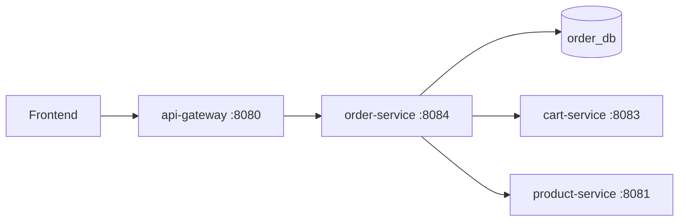
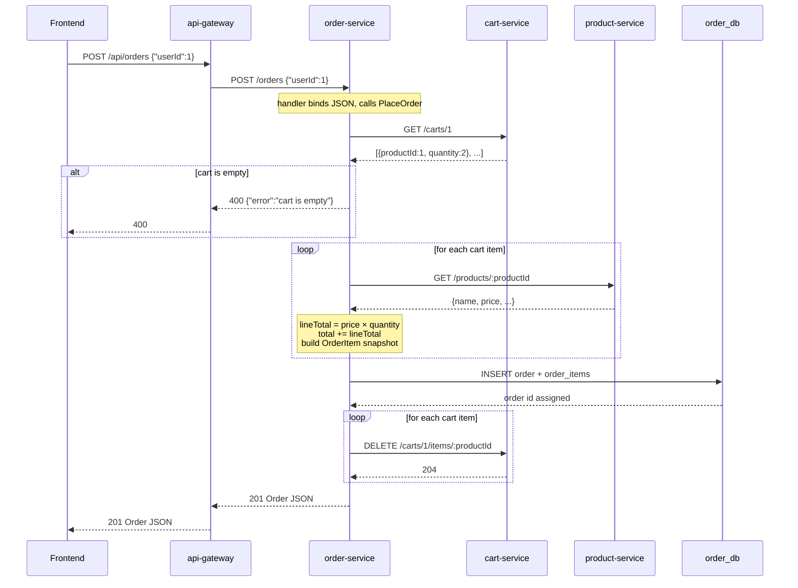

# Order service flow

Checkout turns a user's cart into a persisted order. **order-service** reads the cart from **cart-service**, fetches current prices from **product-service**, saves the order in **order_db**, then clears the cart.

## Ports and paths

| Where | URL |
|-------|-----|
| Gateway (frontend) | `http://localhost:8080/api/orders/...` |
| order-service (internal) | `http://localhost:8084/orders/...` |

The gateway rewrites `/api/orders` → `/orders` and forwards to `ORDER_SERVICE_URL`.

## Endpoints

| Method | Gateway | order-service | Purpose |
|--------|---------|---------------|---------|
| POST | `/api/orders` | `/orders` | Place order (body: `userId`) |
| GET | `/api/orders/:id` | `/orders/:id` | Fetch one order with line items |
| GET | — | `/health` | Health check |

**Note:** Checkout is a single `POST /api/orders` — there is no `:userId` in the path. The user id comes from the JSON body.

## Architecture

```text
Frontend
   │
   ▼
api-gateway :8080                    (ORDER_SERVICE_URL)
   │
   ▼
order-service :8084
   ├──► order_db (Postgres)           read/write orders + order_items
   ├──► cart-service :8083            GET /carts/:userId, DELETE /carts/:userId/items/:productId
   └──► product-service :8081        GET /products/:id (name + price snapshot)
```



## Checkout flow (place order) — detailed

This is the main path: `POST /api/orders` with body `{"userId": 1}`.

### Prerequisites

1. User has items in their cart (see [CART_SERVICE_FLOW.md](CART_SERVICE_FLOW.md)).
2. Each `productId` in the cart still exists in product-service (otherwise checkout fails).

### Sequence diagram



### Step-by-step (code path)

```text
POST /api/orders  {"userId":1}
```

| Step | Layer | What happens |
|------|-------|--------------|
| 1 | **api-gateway** | Receives `/api/orders`, proxies to `http://order-service:8084/orders`. |
| 2 | **handler** (`PlaceOrder`) | Binds JSON body; rejects missing or zero `userId` with `400`. |
| 3 | **service** (`PlaceOrder`) | Starts checkout for the given `userId`. |
| 4 | **cart client** | `GET {CART_SERVICE_URL}/carts/1` — returns `[]CartItem`. |
| 5 | **service** | If `len(cartItems) == 0`, returns `ErrEmptyCart` → handler maps to `400`. |
| 6 | **service** (loop) | For each cart line, calls product client. |
| 7 | **product client** | `GET {PRODUCT_SERVICE_URL}/products/{id}` — returns name and price. |
| 8 | **service** | Computes `lineTotal = price × quantity`, accumulates `totalAmount`, builds `OrderItem` rows with **snapshotted** `productName` and `price` (so later catalog changes do not alter past orders). |
| 9 | **repository** | `Create(order)` — GORM inserts one `orders` row and all `order_items` in one call. |
| 10 | **service** (loop) | For each original cart line, `DELETE {CART_SERVICE_URL}/carts/1/items/{productId}`. |
| 11 | **service** | If a cart DELETE fails, logs a warning but still returns the created order (`201`). The order is already committed; cart clear is best-effort in Phase 0. |
| 12 | **handler** | Returns `201` with full order JSON (id, userId, totalAmount, createdAt, items). |

### Example response

```json
{
  "id": 1,
  "userId": 1,
  "totalAmount": 159998,
  "createdAt": "2026-06-05T10:30:58.910476Z",
  "items": [
    {
      "id": 1,
      "orderId": 1,
      "productId": 1,
      "productName": "iPhone 16",
      "price": 79999,
      "quantity": 2
    }
  ]
}
```

`totalAmount` = sum of `(price × quantity)` for every line item at checkout time.

## Get order flow

```text
GET /api/orders/1
```

1. **api-gateway** — proxies to `http://order-service:8084/orders/1`.
2. **handler** (`GetOrder`) — parses `:id`; invalid id → `400`.
3. **service** (`GetOrder`) — delegates to repository.
4. **repository** — `FindByID` with `Preload("Items")` from `order_db`.
5. **handler** — `200` with order JSON, or `404` if not found.

No calls to cart-service or product-service on read — the order is self-contained with snapshotted line items.

## Layer map

```text
cmd/server/main.go       → wire dependencies, register Gin routes
internal/handler         → HTTP / JSON (bind body, parse :id, map errors)
internal/service         → checkout orchestration (cart → price → save → clear)
internal/repository      → GORM create + find with Preload(Items)
internal/client          → HTTP to cart-service and product-service
internal/model           → Order, OrderItem structs
internal/database        → Postgres connect + AutoMigrate orders tables
```

Startup order in `main.go`:

```text
database.Connect()
  → NewOrderRepository()
  → NewCartClient()
  → NewProductClient()
  → NewOrderService(repo, cartClient, productClient)
  → NewOrderHandler(svc)
  → routes
```

## Data model

Database: `order_db`

### Table: `orders`

| Column | Type | Notes |
|--------|------|-------|
| `id` | serial | Primary key |
| `user_id` | bigint | Who placed the order |
| `total_amount` | decimal/float | Sum of all line totals at checkout |
| `created_at` | timestamp | Set automatically by GORM |

### Table: `order_items`

| Column | Type | Notes |
|--------|------|-------|
| `id` | serial | Primary key |
| `order_id` | bigint | FK to `orders.id` |
| `product_id` | bigint | Catalog reference (not enforced across DBs) |
| `product_name` | text | **Snapshot** at checkout |
| `price` | decimal/float | **Snapshot** at checkout |
| `quantity` | int | From cart at checkout |

**Why snapshots?** Product names and prices can change in `product_db` after an order is placed. Storing them on `order_items` keeps invoices and order history accurate.

## HTTP status codes

### `POST /orders` (checkout)

| Status | When |
|--------|------|
| `201` | Order created; cart cleared (or clear partially failed but order saved) |
| `400` | Missing/invalid `userId`, empty cart, or cart contains a deleted product |
| `500` | cart-service unreachable, product-service error, or database failure |

### `GET /orders/:id`

| Status | When |
|--------|------|
| `200` | Order found |
| `400` | Invalid order id |
| `404` | Order not found |
| `500` | Database error |

## Error mapping (handler → service → client)

| Sentinel error | Source | HTTP |
|----------------|--------|------|
| `service.ErrEmptyCart` | No lines in cart | `400` |
| `client.ErrProductNotFound` | Product deleted since item was added | `400` |
| `repository.ErrOrderNotFound` | Unknown order id on GET | `404` |
| Network / decode / DB errors | cart, product, or postgres | `500` |

## Environment variables

| Variable | Default (local) | Docker Compose |
|----------|-----------------|----------------|
| `PORT` | `8084` | `8084` |
| `DB_HOST` / `DB_NAME` | — / `order_db` | `postgres` / `order_db` |
| `CART_SERVICE_URL` | `http://localhost:8083` | `http://cart-service:8083` |
| `PRODUCT_SERVICE_URL` | `http://localhost:8081` | `http://product-service:8081` |

Gateway also needs `ORDER_SERVICE_URL=http://order-service:8084` inside Docker (see `deploy/docker-compose.yml`).

## Docker notes

- **Database:** `order_db` is created by `deploy/init/01-create-databases.sql` on a fresh Postgres volume. For existing volumes, `deploy/scripts/ensure-databases.sh` runs via the `db-bootstrap` service.
- **Depends on:** Postgres (healthy), `db-bootstrap`, cart-service, product-service.
- **Startup order:** cart-service and product-service must be up before order-service can complete checkouts.

## Try it (full checkout)

```bash
cd deploy && docker compose up --build

# Gateway health (includes order-service)
curl http://localhost:8080/health

# 1. Add items to cart first
curl -X POST http://localhost:8080/api/carts/1/items \
  -H "Content-Type: application/json" \
  -d '{"productId":1,"quantity":2}'

# 2. Place order
curl -X POST http://localhost:8080/api/orders \
  -H "Content-Type: application/json" \
  -d '{"userId":1}'

# 3. Cart should be empty
curl http://localhost:8080/api/carts/1

# 4. Fetch the order
curl http://localhost:8080/api/orders/1

# 5. Empty cart checkout returns 400
curl -X POST http://localhost:8080/api/orders \
  -H "Content-Type: application/json" \
  -d '{"userId":1}'
# {"error":"cart is empty"}
```

## Local development (without Docker)

1. Ensure Postgres has `order_db` (see `deploy/init/` or `CREATE DATABASE order_db;`).
2. Start dependencies, then order-service:

```bash
cd product-service && PORT=8081 DB_NAME=product_db go run ./cmd/server
cd cart-service && PORT=8083 DB_NAME=cart_db PRODUCT_SERVICE_URL=http://localhost:8081 go run ./cmd/server
cd order-service && PORT=8084 DB_NAME=order_db \
  CART_SERVICE_URL=http://localhost:8083 \
  PRODUCT_SERVICE_URL=http://localhost:8081 go run ./cmd/server
cd api-gateway && PORT=8080 \
  CART_SERVICE_URL=http://localhost:8083 \
  ORDER_SERVICE_URL=http://localhost:8084 go run ./cmd/server
```

## Relation to other services

| Service | Role in checkout |
|---------|------------------|
| [cart-service](CART_SERVICE_FLOW.md) | Source of line items (`productId`, `quantity`); cleared after order is saved |
| product-service | Live catalog lookup for name and price at checkout time |
| user-service | Provides `userId` after login; not called directly by order-service yet |
| api-gateway | Single entry point; proxies `/api/orders` |

Typical user journey:

```text
login (user-service) → browse (product-service) → add to cart (cart-service) → checkout (order-service)
```

## Design notes and limitations (Phase 0)

- **No distributed transaction:** Order is saved first, then cart is cleared via separate HTTP DELETEs. If cart clear fails, the user may see duplicate-checkout risk if they retry — logged but not rolled back.
- **No auth on routes:** `userId` is passed in the request body; production should verify JWT and ensure callers can only checkout their own cart.
- **Synchronous only:** Checkout blocks until cart read, pricing, DB write, and cart clear complete. Phase 1 will add Kafka `order.placed` events for async notifications after the order is persisted.
- **No inventory deduction:** Stock is not decremented; that is future event-driven work.

## Future: Kafka (Phase 1)

After `repository.Create` succeeds and before returning `201`, order-service will publish an `order.placed` event to Kafka. **notification-service** will consume it and send confirmations without blocking checkout. See the project plan for `KAFKA_IMPLEMENTATION.md` when that phase lands.
