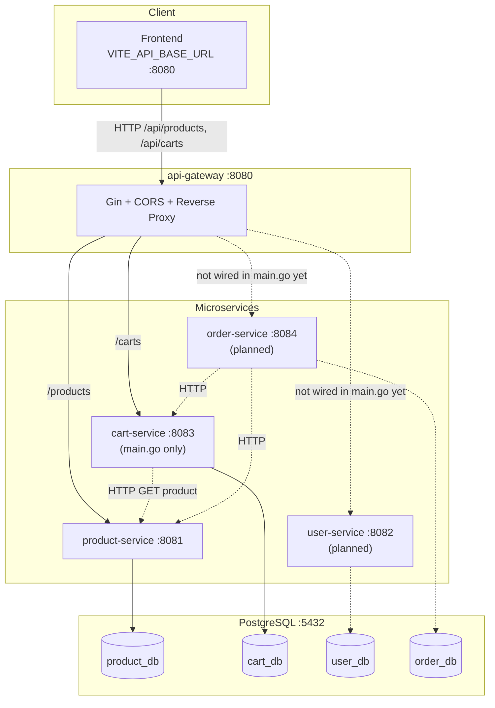
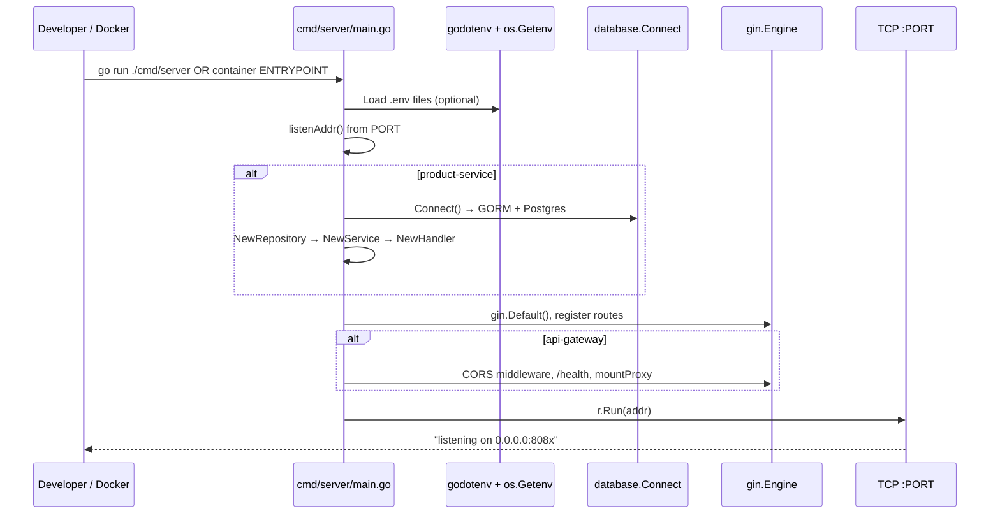
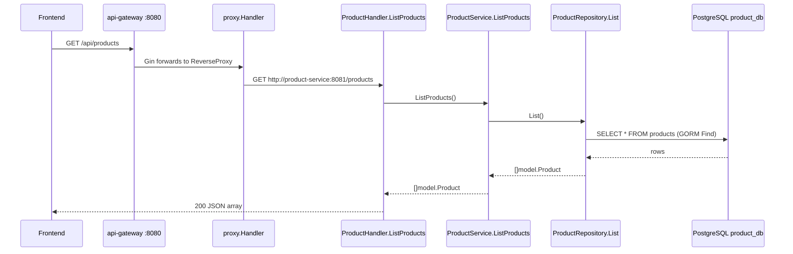
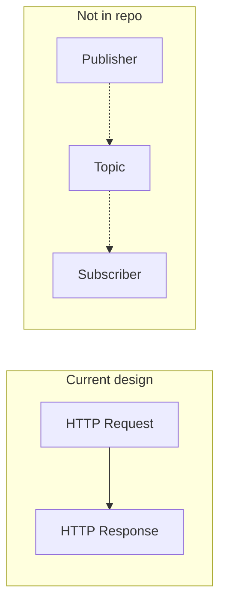
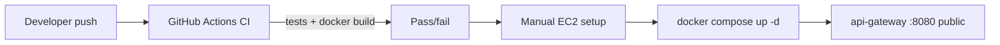

# Ecommerce Backend — Project Flow Explanation

This guide explains **this repository as it exists on disk today**, written for someone new to backend development and microservices. Every file path, route, and function name below comes from the actual project—not generic tutorials.

> **Workspace snapshot (important):** The repo currently has **api-gateway** (8080) and **product-service** (8081). **user-service**, **cart-service**, and **order-service** are not in the tree yet; sections below that mention them are **planned** architecture.

---

## Table of Contents

1. [Project Architecture](#1-project-architecture)
2. [Application Startup Flow](#2-application-startup-flow)
3. [Folder Structure](#3-folder-structure)
4. [REST API Flow](#4-rest-api-flow)
5. [Database Flow](#5-database-flow)
6. [EDA / Event Flow](#6-eda--event-flow)
7. [Deployment Flow](#7-deployment-flow)
8. [Beginner Notes](#8-beginner-notes)
9. [Learning Path](#9-learning-path)

---

## 1. Project Architecture

### What is this project?

A **Go monorepo** of small, independent **microservices** behind one public entry point (**api-gateway**). A frontend (for example `ecommerce-frontend/product-mf`) talks only to port **8080**; the gateway forwards traffic to internal services.

Think of it like a mall: customers enter through one main door (gateway); behind that door are separate shops (services), each with its own stock room (database).

### Microservices and responsibilities

| Service | Port (default) | On disk? | Responsibility |
|---------|----------------|----------|----------------|
| **api-gateway** | 8080 | Yes | Public HTTP entry, CORS, reverse proxy to backends |
| **product-service** | 8081 | Yes | Product catalog (list / get by id) |
| **cart-service** | 8083 | Partial (`main.go` only) | Shopping carts per user *(intended)* |
| **user-service** | 8082 | No folder | Registration, login, profile *(planned)* |
| **order-service** | 8084 | No folder | Create orders from carts *(planned)* |

Source: `README.md` (full target), `deploy/docker-compose.yml` (runtime wiring), and `find` on the repo root.

### API Gateway role

The gateway does **not** contain business logic for products or carts. It:

1. Loads environment variables (including optional `.env` files).
2. Enables **CORS** so browsers on `localhost:3000` / `5173` can call the API.
3. Exposes `GET /health` and checks downstream `/health` endpoints.
4. **Proxies** paths like `/api/products/*` → `product-service` as `/products/*`.

Implementation lives in:

- `api-gateway/cmd/server/main.go` — routes and server start
- `api-gateway/internal/proxy/proxy.go` — path rewriting and `httputil.ReverseProxy`

**Current gateway routes (on disk):**

```go
// api-gateway/cmd/server/main.go (excerpt)
mountProxy(r, "/api/products", "/products", productURL)  // → PRODUCT_SERVICE_URL
mountProxy(r, "/api/carts", "/carts", cartURL)            // → CART_SERVICE_URL
```

`docker-compose.yml` also sets `USER_SERVICE_URL` and `ORDER_SERVICE_URL` for the gateway, but **those proxies are not mounted in the current `main.go`**—only products and carts.

### Databases

- **One PostgreSQL instance** (`postgres:16-alpine` in Docker).
- **Per-service logical databases** (isolation by `DB_NAME`):

| Database | Created in init SQL? | Used by |
|----------|----------------------|---------|
| `product_db` | Yes — `deploy/init/01-create-databases.sql` | product-service |
| `cart_db` | Yes — same file | cart-service *(when implemented)* |
| `user_db` | Mentioned in README, not in current `01-create-databases.sql` | user-service *(planned)* |
| `order_db` | Mentioned in README, not in current `01-create-databases.sql` | order-service *(planned)* |

Seed data for products: `deploy/init/02-seed-product_db.sql` (table `products` + sample rows).

### Service-to-service communication

This project uses **synchronous HTTP (REST)** between services—not message queues.

| Caller | Calls | Env variable | Purpose |
|--------|-------|--------------|---------|
| **api-gateway** | product-service, cart-service | `PRODUCT_SERVICE_URL`, `CART_SERVICE_URL` | Proxy public `/api/*` traffic |
| **cart-service** *(intended)* | product-service | `PRODUCT_SERVICE_URL` | Validate product exists when adding to cart |
| **order-service** *(planned)* | cart-service, product-service | `CART_SERVICE_URL`, `PRODUCT_SERVICE_URL` | Build order from cart + prices |

There is **no** Kafka, RabbitMQ, NATS, or similar in the codebase (grep found no event bus usage).

### Architecture diagram (current + planned)



---

## 2. Application Startup Flow

### Option A: `docker compose up` (from `deploy/`)

**Command:** `cd deploy && docker compose up --build`

**What runs first:** Docker starts **`postgres`** because other services `depends_on` it (with `condition: service_healthy` where configured).

#### Postgres bootstrap

1. Container starts with `POSTGRES_USER` / `POSTGRES_PASSWORD` from `deploy/docker-compose.yml`.
2. Scripts in `./init` mount to `/docker-entrypoint-initdb.d`:
   - `01-create-databases.sql` → `CREATE DATABASE product_db;` and `cart_db`
   - `02-seed-product_db.sql` → connects to `product_db`, creates `products`, inserts seed rows
3. Healthcheck `pg_isready` must pass before **product-service** and **user-service** start.

#### Service containers

Each Go service image is built from its `Dockerfile` (multi-stage: compile `./cmd/server`, run binary).

Example **product-service** Dockerfile flow:

```dockerfile
# product-service/Dockerfile (conceptual steps)
# 1. COPY go.mod, go.sum → go mod download
# 2. COPY cmd/, internal/ → go build -o /product-service ./cmd/server
# 3. Alpine image runs ENTRYPOINT ["/product-service"]
```

**Startup order in compose:**

1. `postgres` (healthy)
2. `product-service`, `user-service` *(compose expects these images)*
3. `cart-service` (depends on `product-service`)
4. `order-service` (depends on `cart-service`, `product-service`)
5. `api-gateway` (depends on all four backends)

> **Note:** With only product-service + partial cart on disk, a full `docker compose up --build` may fail until cart/user/order images exist.

### Option B: `go run ./cmd/server` (local)

**Entry file (always):** `<service>/cmd/server/main.go` — Go’s convention: `package main` + `func main()` is the process entry.

Example for product-service:

```bash
cd product-service
PORT=8081 DB_NAME=product_db go run ./cmd/server
```

There is no separate `main.go` at the service root; the path is **`cmd/server/main.go`**.

### Configuration and `.env` loading

| Component | How config is loaded |
|-----------|----------------------|
| **api-gateway** | `godotenv.Load()` tries `.`, `../.env`, `../../.env`; then `os.Getenv` via helper `env(key, fallback)` |
| **product-service DB** | Same `godotenv` pattern in `database.Connect()`; DSN built from `DB_HOST`, `DB_USER`, `DB_PASSWORD`, `DB_NAME`, `DB_PORT` |
| **Docker** | Variables set in `deploy/docker-compose.yml` `environment:` blocks (no `.env` required in container) |
| **Local template** | `deploy/.env.example` — copy to repo root `.env` per README |

```go
// api-gateway/cmd/server/main.go
func main() {
    _ = godotenv.Load()           // load .env from current directory if present
    _ = godotenv.Load("../.env")  // when running from api-gateway/
    _ = godotenv.Load("../../.env") // when running from api-gateway/cmd/server

    addr := listenAddr()          // PORT env → "0.0.0.0:8080"
    productURL := env("PRODUCT_SERVICE_URL", "http://localhost:8081")
    // ...
}
```

`.env` is gitignored (see `.gitignore`); never commit secrets.

### Database connection creation (product-service)

Called early in `main()`:

```go
// product-service/cmd/server/main.go
func main() {
    addr := listenAddr()
    database.Connect()  // opens global database.DB (GORM)

    repo := repository.NewProductRepository()
    svc := service.NewProductService(repo)
    h := handler.NewProductHandler(svc)
    // ...
}
```

See [Section 5](#5-database-flow) for `database.Connect()` internals.

### Route registration

Uses **Gin** (`github.com/gin-gonic/gin`):

```go
// product-service/cmd/server/main.go
r := gin.Default()
r.GET("/health", h.Health)
r.GET("/products", h.ListProducts)
r.GET("/products/:id", h.GetProduct)
```

Gateway registers Gin routes **and** mounts the reverse proxy:

```go
r.GET("/health", /* aggregated health */)
mountProxy(r, "/api/products", "/products", productURL)
```

`mountProxy` registers `r.Any` for both `gatewayPrefix/*path` and `gatewayPrefix`.

### HTTP server start

```go
if err := r.Run(addr); err != nil {  // Gin listens on 0.0.0.0:PORT
    log.Fatal("server failed:", err)
}
```

`listenAddr()` returns `"0.0.0.0:" + port` so the process accepts connections from Docker networks and localhost.

### Startup sequence diagram (product-service + gateway)



---

## 3. Folder Structure

### Repository root (on disk)

```
ecommerce-backend/
├── api-gateway/          # Public entry point
├── product-service/      # Catalog microservice (complete)
├── cart-service/         # Cart microservice (main.go only; internal/ empty)
├── deploy/               # Docker Compose, DB init, .env.example
├── .github/workflows/    # CI pipeline
├── README.md
└── .env                  # Local secrets (gitignored; may exist on your machine)
```

### Per-service layout (product-service is the reference pattern)

```
product-service/
├── cmd/server/main.go       # Entry: wire deps, routes, start server
├── internal/
│   ├── database/            # DB connection singleton
│   ├── model/               # Structs ↔ tables
│   ├── repository/          # SQL/GORM access
│   ├── service/             # Business rules
│   └── handler/             # HTTP layer (Gin handlers)
├── Dockerfile
├── go.mod
└── go.sum
```

**cart-service** mirrors this layout in `main.go` imports, but `internal/*` directories are currently empty—implementation still needed.

### Layer analogies (real-world)

| Layer | Folder | Analogy |
|-------|--------|---------|
| **Handler** | `internal/handler/` | **Waiter** — takes the order (HTTP), talks to the kitchen, brings the plate (JSON response) |
| **Service** | `internal/service/` | **Chef** — business rules: “is this id valid?”, “can we add this item?” |
| **Repository** | `internal/repository/` | **Pantry clerk** — gets ingredients from storage (database); no HTTP knowledge |
| **Model** | `internal/model/` | **Recipe card** — shape of one row (product, cart item, etc.) |
| **database** | `internal/database/` | **Phone line to the warehouse** — one shared connection (`var DB`) |
| **client** | `internal/client/` *(cart/order)* | **Phone call to another shop** — HTTP to another microservice |
| **proxy** | `api-gateway/internal/proxy/` | **Receptionist redirect** — “aisle 3 is actually in building B” (path rewrite) |
| **cmd/server** | `cmd/server/main.go` | **Store manager opening the shop** — opens DB, hires team, opens doors |

There is no separate `routes/` package; routes are registered inline in `main.go` (common in small Go services).

---

## 4. REST API Flow

### How APIs are created and registered

1. **Define routes** in `cmd/server/main.go` with `r.GET`, `r.POST`, etc.
2. **Implement handlers** on `*XxxHandler` methods in `internal/handler/`.
3. Handlers call **service** methods; services call **repository** (or **HTTP client** to another service).
4. Handlers write JSON with `c.JSON(status, body)`.

Product-service public routes (direct to service, no gateway prefix):

| Method | Service path | Handler |
|--------|--------------|---------|
| GET | `/health` | `ProductHandler.Health` |
| GET | `/products` | `ProductHandler.ListProducts` |
| GET | `/products/:id` | `ProductHandler.GetProduct` |

Through the gateway, the frontend uses:

| Method | Gateway path | Proxied to |
|--------|--------------|------------|
| GET | `/api/products` | `GET /products` on product-service |
| GET | `/api/products/1` | `GET /products/1` |

Path rewrite logic (`api-gateway/internal/proxy/proxy.go`):

```go
// stripPrefix "/api/products" + request "/api/products/1"
// becomes rewritePrefix "/products" + suffix "/1" → "/products/1"
func Handler(target *url.URL, stripPrefix, rewritePrefix string) http.Handler {
    proxy := httputil.NewSingleHostReverseProxy(target)
    proxy.Director = func(req *http.Request) {
        // ... set Host, rewrite req.URL.Path ...
    }
    return proxy
}
```

### End-to-end trace: `GET /api/products` (list products)

This is the best fully implemented flow in the repo today.



#### Step-by-step with code

**1. Frontend** — `README.md` example:

```bash
curl http://localhost:8080/api/products
```

**2. Gateway** — `mountProxy` + `proxy.Handler` forwards to `PRODUCT_SERVICE_URL` with path `/products`.

**3. Handler** — parse request, call service, map errors to HTTP status:

```go
// product-service/internal/handler/product_handler.go
func (h *ProductHandler) ListProducts(c *gin.Context) {
    products, err := h.svc.ListProducts()  // delegate to service layer
    if err != nil {
        c.JSON(http.StatusInternalServerError, gin.H{"error": err.Error()})
        return
    }
    c.JSON(http.StatusOK, products)  // serialize []Product as JSON
}
```

**4. Service** — thin orchestration (no HTTP types):

```go
// product-service/internal/service/product_service.go
func (s *ProductService) ListProducts() ([]model.Product, error) {
    return s.repo.List()  // all DB access stays behind repository
}
```

**5. Repository** — GORM query on shared `database.DB`:

```go
// product-service/internal/repository/product_repo.go
func (r *ProductRepository) List() ([]model.Product, error) {
    var products []model.Product
    if err := database.DB.Find(&products).Error; err != nil {  // GORM: SELECT * FROM products
        return nil, err
    }
    return products, nil
}
```

**6. Model** — JSON field names vs DB column names:

```go
// product-service/internal/model/product.go
type Product struct {
    ID       int     `json:"id"`
    Name     string  `json:"name" gorm:"column:product_name"`  // DB column product_name
    Price    float64 `json:"price"`
    Category string  `json:"category"`
    ImageURL string  `json:"image_url" gorm:"column:image_url"`
}
func (Product) TableName() string { return "products" }
```

**7. Response** — JSON array of products back through the proxy unchanged.

### Cart routes (intended, from `cart-service/cmd/server/main.go`)

| Method | Path | Handler method |
|--------|------|----------------|
| GET | `/health` | `Health` |
| GET | `/carts/:userId` | `GetCart` |
| POST | `/carts/:userId/items` | `AddItem` |
| PATCH | `/carts/:userId/items/:productId` | `UpdateItem` |
| DELETE | `/carts/:userId/items/:productId` | `RemoveItem` |

Gateway would expose `/api/carts/...` → `/carts/...`. Implementation files under `cart-service/internal/` are not on disk yet.

### User / Order APIs (planned — README only)

Examples from `README.md` (not implementable in this workspace until services exist):

- `POST /api/users`, `POST /api/users/login`
- `POST /api/orders` with body `{"userId":1}`

---

## 5. Database Flow

### Connection initialization

```go
// product-service/internal/database/database.go

var DB *gorm.DB  // package-level singleton used by all repositories

func Connect() {
    // Step 1: Load optional .env from several relative paths
    _ = godotenv.Load()
    _ = godotenv.Load("../.env")
    _ = godotenv.Load("../../.env")

    // Step 2: Resolve database name (Docker may use POSTGRES_DB; locally DB_NAME)
    dbName := env("POSTGRES_DB", "DB_NAME")
    if dbName == "" {
        dbName = "product_db"  // sensible default for this service
    }

    // Step 3: Build Postgres DSN string
    dsn := fmt.Sprintf("host=%s user=%s password=%s dbname=%s port=%s TimeZone=%s sslmode=%s",
        env("POSTGRES_HOST", "DB_HOST"),
        env("POSTGRES_USER", "DB_USER"),
        env("POSTGRES_PASSWORD", "DB_PASSWORD"),
        dbName,
        env("POSTGRES_PORT", "DB_PORT"),
        env("POSTGRES_TIMEZONE", "UTC"),
        sslmode,  // defaults to "disable" for local dev
    )

    // Step 4: Open GORM connection; fatal exit if connection fails
    DB, err = gorm.Open(postgres.Open(dsn), &gorm.Config{
        Logger: logger.Default.LogMode(logger.Info),  // logs SQL in dev
    })
    if err != nil {
        log.Fatalf("product-service: database connect failed: %v", err)
    }
}
```

**Why a global `DB`?** Simplicity for a small service. One process, one pool. Repositories import `database` and use `database.DB`.

### Models

- Go struct in `internal/model/`.
- `gorm` tags map struct fields to SQL columns when names differ (`product_name` → `Name`).
- `TableName()` overrides default pluralization if needed.

### Migrations

This repo does **not** use a Go migration tool (no `golang-migrate`, etc.). Schema is applied by:

1. **Docker init scripts** — `deploy/init/02-seed-product_db.sql` creates `products` and seed data.
2. **Implicit GORM** — reads/writes assume the table already exists; GORM is not auto-creating schema in `Connect()`.

For production you would typically add versioned migrations; here the source of truth for `product_db` is the SQL init file.

### CRUD in practice (product-service)

| Operation | Repository method | GORM call |
|-----------|-------------------|-----------|
| **Read all** | `List()` | `DB.Find(&products)` |
| **Read one** | `GetByID(id)` | `DB.First(&product, id)` |
| **Not found** | `GetByID` | `errors.Is(err, gorm.ErrRecordNotFound)` → `ErrProductNotFound` |

```go
// product-service/internal/repository/product_repo.go
func (r *ProductRepository) GetByID(id int) (model.Product, error) {
    var product model.Product
    err := database.DB.First(&product, id).Error  // SELECT ... WHERE id = ?
    if errors.Is(err, gorm.ErrRecordNotFound) {
        return model.Product{}, ErrProductNotFound  // domain error for handler → 404
    }
    return product, err
}
```

Handler maps `ErrProductNotFound` → HTTP 404:

```go
if errors.Is(err, repository.ErrProductNotFound) {
    c.JSON(http.StatusNotFound, gin.H{"error": "product not found"})
    return
}
```

### Seed schema (SQL)

```sql
-- deploy/init/02-seed-product_db.sql (excerpt)
\c product_db;

CREATE TABLE IF NOT EXISTS products (
    id SERIAL PRIMARY KEY,
    product_name VARCHAR(255),
    category VARCHAR(100),
    price NUMERIC(10, 2),
    image_url VARCHAR(255)
);
-- INSERT sample products ...
```

---

## 6. EDA / Event Flow

**This project does not use event-driven architecture** today.

- No publishers, subscribers, topics, or message brokers in the codebase.
- All cross-service integration is **HTTP request/response** (gateway proxy; cart/order clients planned via env URLs).

| Pattern | When used here | Why |
|---------|----------------|-----|
| **REST / HTTP** | Frontend → gateway → services; service → service | Simple, easy to debug with `curl`, fits CRUD and request/response |
| **Events (not used)** | — | Would help async workflows (e.g. “order placed” emails); not implemented yet |

If events were added later, they would typically sit **beside** REST: REST for queries/commands that need an immediate answer; events for side effects and decoupling.



---

## 7. Deployment Flow

### GitHub Actions (`.github/workflows/ci.yml`)

**Triggers:** push or pull request to `main`.

**Job:** `build` — matrix over five folders:

- `api-gateway`, `product-service`, `user-service`, `cart-service`, `order-service`

**Per service steps:**

1. `actions/checkout@v5`
2. `actions/setup-go@v6` — Go version from that service’s `go.mod`
3. `go mod tidy` + `go mod verify` + fail if `go.mod`/`go.sum` drift
4. `go test ./...`
5. `go build -o server ./cmd/server`
6. `golangci-lint-action@v8`
7. `docker build -t <service> .`

CI validates code quality and buildability; it does **not** deploy to AWS automatically.

### EC2 deployment (manual — from `README.md`)

There is no EC2/GitHub deploy workflow in the repo. Production-style steps documented:

1. **Security group** — open port **8080** (api-gateway).
2. On the instance: clone repo, `cd deploy`, run `docker compose up -d`.
3. **Frontend** — set `VITE_API_BASE_URL=http://<EC2_PUBLIC_IP>:8080`.
4. **CORS** — add the frontend origin to gateway env `CORS_ALLOWED_ORIGINS` (in compose or host env).



---

## 8. Beginner Notes

### api-gateway

| | |
|--|--|
| **What** | Single public URL; CORS; reverse proxy |
| **Why** | Frontend talks to one host; hides internal ports; central place for CORS |
| **Mistakes** | Calling `localhost:8081` from the browser (CORS / wrong URL); forgetting path prefix `/api` vs service `/products` |
| **Debug** | `curl http://localhost:8080/health`; check `PRODUCT_SERVICE_URL`; compare gateway path rewrite in `proxy.go` |

### product-service

| | |
|--|--|
| **What** | Owns `product_db` and product HTTP API |
| **Why** | Isolate catalog from carts/orders; scale independently |
| **Mistakes** | Wrong `DB_NAME`; empty DB without running init SQL; expecting `name` column instead of `product_name` |
| **Debug** | `curl http://localhost:8081/health` and `/products`; read GORM SQL logs; connect with `psql` to `product_db` |

### cart-service (in progress)

| | |
|--|--|
| **What** | Per-user cart; should call product-service to validate SKUs |
| **Why** | Cart state changes often; shouldn’t bloat product or order DB |
| **Mistakes** | Building cart without product client (stale/invalid product ids) |
| **Debug** | Once implemented: hit `:8083/health`, then gateway `/api/carts/1` |

### Handlers vs services vs repositories

| | |
|--|--|
| **What** | Handler = HTTP; Service = rules; Repository = DB |
| **Why** | Change DB or framework without rewriting business rules |
| **Mistakes** | SQL in handlers; returning `gin.H` from repositories |
| **Debug** | Trace one request top-down from `main.go` route → handler method |

### deploy/

| | |
|--|--|
| **What** | Compose stack, DB init, env template |
| **Why** | One command to run the whole system locally |
| **Mistakes** | Running compose from wrong directory; Postgres volume already initialized (init scripts won’t re-run) |
| **Debug** | `docker compose ps`, `docker compose logs product-service`, `docker compose logs postgres` |

### PostgreSQL init scripts

| | |
|--|--|
| **What** | Run **once** on first volume creation |
| **Why** | Create databases and seed products automatically |
| **Mistakes** | Editing `02-seed-*.sql` and expecting changes without wiping volume |
| **Debug** | `docker volume rm` / fresh volume, or run SQL manually |

---

## 9. Learning Path

Read and run in this order to go from “zero” to “follow one request”:

### Phase 1 — Big picture (30 min)

1. `README.md` — services, ports, curl examples.
2. `deploy/docker-compose.yml` — which containers exist and env vars.
3. `deploy/.env.example` — local configuration names.
4. This file — architecture diagrams.

### Phase 2 — Request path (1–2 hours)

5. `api-gateway/cmd/server/main.go` — CORS, health, `mountProxy`.
6. `api-gateway/internal/proxy/proxy.go` — path rewriting.
7. `product-service/cmd/server/main.go` — wiring order: DB → repo → service → handler → routes.
8. `product-service/internal/handler/product_handler.go` — HTTP status codes.
9. `product-service/internal/service/product_service.go` — thin business layer.
10. `product-service/internal/repository/product_repo.go` — GORM queries.
11. `product-service/internal/model/product.go` — JSON vs DB columns.
12. `product-service/internal/database/database.go` — DSN and connection.

### Phase 3 — Data (30 min)

13. `deploy/init/01-create-databases.sql` — which DBs exist.
14. `deploy/init/02-seed-product_db.sql` — table shape and sample data.

### Phase 4 — Run it (hands-on)

15. Start Postgres + product-service + gateway (Docker or local commands from README).
16. `curl http://localhost:8080/health`
17. `curl http://localhost:8080/api/products` — trace mentally through Section 4.

### Phase 5 — Cart and beyond (when code exists)

18. `cart-service/cmd/server/main.go` — routes and intended `productClient`.
19. Compare with product-service layers to implement missing `internal/` packages.
20. When `user-service` / `order-service` appear on disk, repeat Phase 2 for each `cmd/server/main.go`.

### Phase 6 — Ops

21. `.github/workflows/ci.yml` — what runs on every PR.
22. `README.md` EC2 section — manual production deployment.

### Mental model checklist

- [ ] I know the **only** entry point the browser should use (`:8080` gateway).
- [ ] I can name the **four layers** in product-service for one endpoint.
- [ ] I understand **gateway path** vs **service path** (`/api/products` vs `/products`).
- [ ] I know where **schema** comes from (SQL init, not magic ORM migrate).
- [ ] I know this repo uses **HTTP between services**, not events.

---

## Quick reference

| Item | Value |
|------|--------|
| Gateway module | `github.com/tv-anagha/ecommerce-backend/api-gateway` |
| Product module | `github.com/tv-anagha/ecommerce-backend/product-service` |
| HTTP framework | Gin |
| ORM | GORM + `gorm.io/driver/postgres` |
| Proxy | `net/http/httputil.ReverseProxy` |
| Frontend env | `VITE_API_BASE_URL=http://localhost:8080` |

---

*Document generated from the repository tree and source files at the workspace root. Re-read `api-gateway/cmd/server/main.go` and `deploy/docker-compose.yml` after adding user-service, order-service, or cart internals—they may change routes and database init.*
